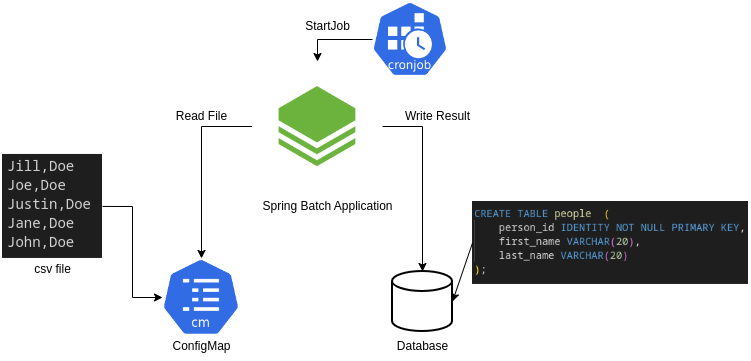

# Spring Batch 5 - Openshift

Este projeto é um exemplo de rodar um Job construído em Spring Batch, Versão 5.0.X, disparado através de um Job ou CronJob no Openshift.

A aplicação é baseada neste guia abaixo e teve seu cenário adaptado para executar no Openshift.   
https://spring.io/guides/gs/batch-processing/

## Visão Geral da Solução

Neste cenário, o job irá fazer a leitura de um arquivo CSV montado via ConfigMap, Extrair os dados (primeiro e último nome) e inserir em uma tabela de banco de dados H2. 

## Montando a Solução no Openshift

1. Crie o projeto abaixo:

~~~
oc new-project batch
~~~
obs: se o nome do projeto mudar, deve-se trocar o nome da imagem nos aquivos openshift/cron-job.yaml e openshift/job.yaml

2. Criar o build da aplicação
~~~
oc new-build --binary --strategy=docker --name spring-batch
~~~

Teremos uma saída similar:

~~~
~~~ 

3. Iniciar o build a aplicação
~~~
oc start-build spring-batch --from-dir . -F
~~~

Teremos uma saída similar:

~~~
~~~ 

## Criando o Job Agendado - CronJob

oc apply -f openshift/cron-job.yaml 

oc apply -f openshift/job.yaml 

