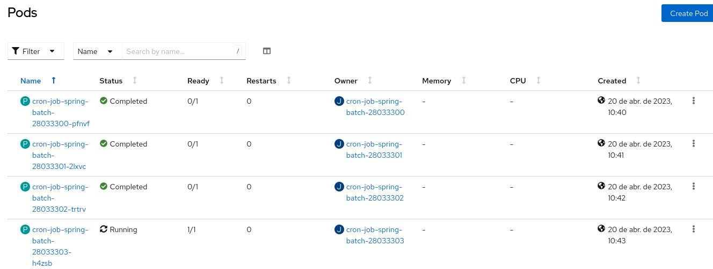
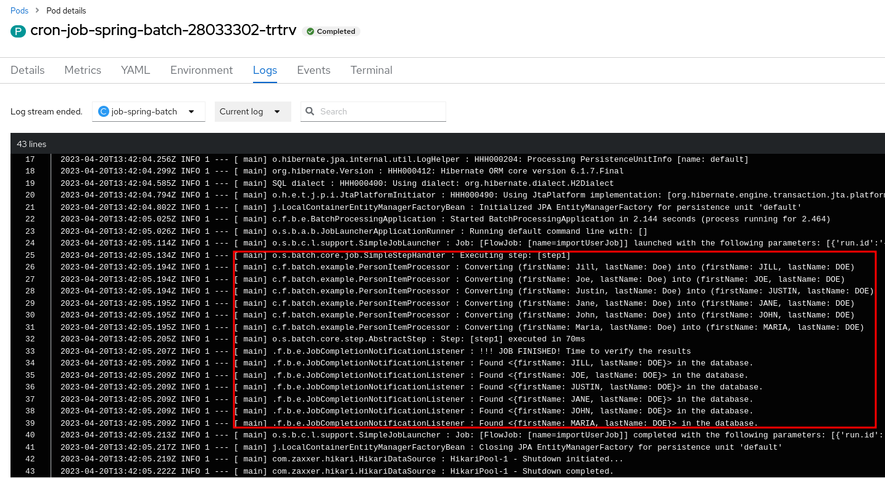

# Spring Batch 5 - Openshift

Este projeto é um exemplo de rodar um Job construído em Spring Batch, Versão 5.0.X, disparado através de um Job ou CronJob no Openshift.

A aplicação é baseada neste guia abaixo e teve seu cenário adaptado para executar no Openshift.   
https://spring.io/guides/gs/batch-processing/

## Visão Geral da Solução

Neste cenário, o job irá fazer a leitura de um arquivo CSV montado via ConfigMap, Extrair os dados (primeiro e último nome) e inserir em uma tabela de banco de dados H2. 

## Montando a Solução no Openshift

1. Crie o projeto abaixo:

~~~
oc new-project batch
~~~
obs: se o nome do projeto mudar, deve-se trocar o nome da imagem nos aquivos openshift/cron-job.yaml e openshift/job.yaml

2. Criar o build da aplicação
~~~
oc new-build --binary --strategy=docker --name spring-batch
~~~

Teremos uma saída similar:

~~~
    * A Docker build using binary input will be created
      * The resulting image will be pushed to image stream tag "spring-batch:latest"
      * A binary build was created, use 'oc start-build --from-dir' to trigger a new build

--> Creating resources with label build=spring-batch ...
    imagestream.image.openshift.io "spring-batch" created
    buildconfig.build.openshift.io "spring-batch" created
--> Success
~~~ 

3. Iniciar o build a aplicação
~~~
oc start-build spring-batch --from-dir . -F
~~~

Teremos uma saída similar:

~~~
Uploading directory "." as binary input for the build ...

Uploading finished
build.build.openshift.io/spring-batch-1 started
Receiving source from STDIN as archive ...
time="2023-04-20T13:22:55Z" level=info msg="Not using native diff for overlay, this may cause degraded performance for building images: kernel has CONFIG_OVERLAY_FS_REDIRECT_DIR enabled"
I0420 13:22:55.898839       1 defaults.go:102] Defaulting to storage driver "overlay" with options [mountopt=metacopy=on].
Caching blobs under "/var/cache/blobs".
.....
Writing manifest to image destination
Storing signatures
Successfully pushed image-registry.openshift-image-registry.svc:5000/batch/spring-batch@sha256:b4fcfdf9aeeca0b21d2bff137ba098361192fa9dcdfffe44c7e22b5024225541
Push successful
~~~ 

## Criando o Job Agendado - CronJob

Olhando o arquivo openshift/cron-job.yaml, temos: 
~~~
---
kind: ConfigMap
apiVersion: v1
metadata:
  name: sample-data
data:
  sample-data.csv: |
    Jill,Doe
    Joe,Doe
    Justin,Doe
    Jane,Doe
    John,Doe
    Maria,Doe
---
apiVersion: batch/v1
kind: CronJob
metadata:
  name: cron-job-spring-batch
spec:
  schedule: "*/1 * * * *"
  jobTemplate:
    spec:
      template:
        spec:
          volumes:
            - name: sample-data
              configMap:
                name: sample-data
                defaultMode: 420
          restartPolicy: Never
          containers:
            - name: job-spring-batch
              image: image-registry.openshift-image-registry.svc:5000/batch/spring-batch:latest
              volumeMounts:
                - name: sample-data
                  mountPath: /home/jboss/sample-data.csv
                  subPath: sample-data.csv
~~~
* A criação do ConfigMap com os dados a serem processados (lista de nomes e sobrenomes)
* CronJob com um shechule para executar a cada minuto.
~~~
oc apply -f openshift/cron-job.yaml 
~~~

Saída similar:
~~~
configmap/sample-data created
Warning: would violate PodSecurity "restricted:v1.24": allowPrivilegeEscalation != false (container "job-spring-batch" must set securityContext.allowPrivilegeEscalation=false), unrestricted capabilities (container "job-spring-batch" must set securityContext.capabilities.drop=["ALL"]), runAsNonRoot != true (pod or container "job-spring-batch" must set securityContext.runAsNonRoot=true), seccompProfile (pod or container "job-spring-batch" must set securityContext.seccompProfile.type to "RuntimeDefault" or "Localhost")
cronjob.batch/cron-job-spring-batch created
~~~

Se olharmos no openshift, poderemos ver os pods sendo criados e executados:

Consultando os logs do job, poderemos ver o arquivo lido e processado:

## Entendendo o código da aplicação

**BatchConfiguration** - Nesta classe, dentre outras coisas, definimos o Job:

Trecho
~~~
@Bean
public Job importUserJob(JobRepository jobRepository,
		JobCompletionNotificationListener listener, Step step1) {
	return new JobBuilder("importUserJob", jobRepository)
		.incrementer(new RunIdIncrementer())
		.listener(listener)
		.flow(step1)
		.end()
		.build();
}
~~~

e o step a ser executado:
~~~
@Bean
public Step step1(JobRepository jobRepository,
		PlatformTransactionManager transactionManager, JdbcBatchItemWriter<Person> writer) {
	return new StepBuilder("step1", jobRepository)
		.<Person, Person> chunk(10, transactionManager)
		.reader(reader())
		.processor(processor())
		.writer(writer)
		.build();
}
~~~
Neste job temos apenas um step, que tem uma fase reader, processamento e writer

No método reader especificamos o caminho de leitura do arquivo, montado via ConfigMap
~~~
@Bean
public FlatFileItemReader<Person> reader() {
	return new FlatFileItemReaderBuilder<Person>()
		.name("personItemReader")
		.resource(new PathResource("/home/jboss/sample-data.csv"))
		.delimited()
		.names(new String[]{"firstName", "lastName"})
		.fieldSetMapper(new BeanWrapperFieldSetMapper<Person>() {{
			setTargetType(Person.class);
		}})
		.build();
}
~~~

No método writer especificamos a query de inserção na base de dados
~~~
@Bean
public JdbcBatchItemWriter<Person> writer(DataSource dataSource) {
	return new JdbcBatchItemWriterBuilder<Person>()
		.itemSqlParameterSourceProvider(new BeanPropertyItemSqlParameterSourceProvider<>())
		.sql("INSERT INTO people (first_name, last_name) VALUES (:firstName, :lastName)")
		.dataSource(dataSource)
		.build();
}
// end::readerwriterprocessor[]
~~~

No método processor especificamos a classe responsável por transformar o dado lido para o formato de escrita.
~~~
@Bean
public PersonItemProcessor processor() {
	return new PersonItemProcessor();
}
~~~

**JobCompletionNotificationListener** - Nesta classe temos uma implementação que será chamada após a execução do Job. Neste caso, iremos listar os dados inseridos. Mas, poderíamos notificar a finalização do job, por exemplo.

~~~
@Override
public void afterJob(JobExecution jobExecution) {
	if(jobExecution.getStatus() == BatchStatus.COMPLETED) {
		log.info("!!! JOB FINISHED! Time to verify the results");
		jdbcTemplate.query("SELECT first_name, last_name FROM people",
			(rs, row) -> new Person(
				rs.getString(1),
				rs.getString(2))
		).forEach(person -> log.info("Found <{{}}> in the database.", person));
		}
	}

~~~

Ao invés de utilizar um CronJob, poderíamos usar um componente Job. Neste caso, o Job seria executado apenas uma vez.
~~~ 
oc apply -f openshift/job.yaml 
~~~
